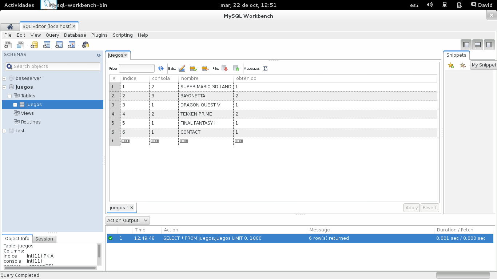
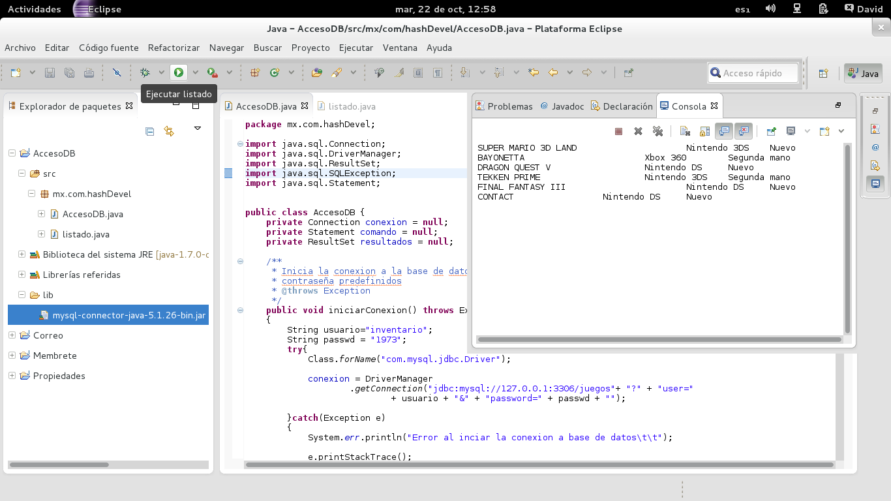
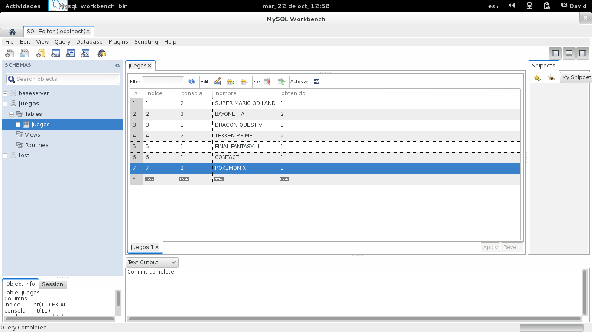
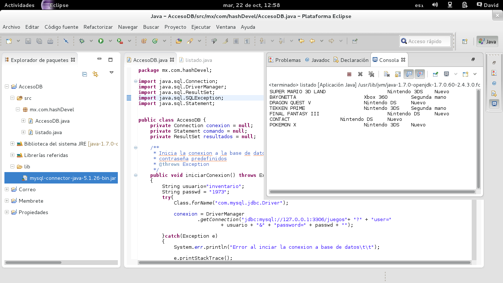

# Acceder a una base de datos MySQL desde Java

Las bases de datos se han vuelto un elemento común en prácticamente todos los proyectos de software y existe una gran cantidad de formas de hacerlo, desde métodos que relacionan la salida de la consulta directamente a objetos a métodos muchos mas sencillos que usan directamente comandos de SQL, uno de estos últimos sera el tema de esta entrada.

## Conector MySQL

Antes de comenzar necesitara tener un servidor MySQL y una base de datos a la que pueda acceder, por el momento no entrare en estos detalles y asumiré que ya los tiene, de no ser el caso basta con un comentario pidiendo mas detalles para crear una entrada del tema, a la vez necesitara de una libreria en Java para acceder a la base de datos el conector a MySQL, este puede ser descargado gratuitamente desde esta dirección: http://dev.mysql.com/downloads/connector/j/3.0.html una ves que tenga los elementos de base de datos y el conector podemos comenzar.



## Creando proyecto en Eclipse

Una vez que halla descargado el conector MySQL abralo y extraiga el archivo mysql-connector-java y agregelo a las librerias del proyecto, una forma de hacer esto esta descrita en una entrada anterior de este mismo blog: iText, Generación de archivo Pdf en Java, ahi encontrara el procedimiento para agregar una libreria a un proyecto en Eclipse, ya que halla agregado la libreria cree una clase Java en el paquete mx.com.hashDevel llamada AccesoDB el codigo de esta se presenta a continuación.

```java
/*
 * To change this license header, choose License Headers in Project Properties.
 * To change this template file, choose Tools | Templates
 * and open the template in the editor.
 */
package mx.com.hashDevel;

import java.sql.Connection;
import java.sql.DriverManager;
import java.sql.ResultSet;
import java.sql.SQLException;
import java.sql.Statement;

/**
 *
 * @author david
 */
public class AccesoDB {

    private Connection conexion = null;
    private Statement comando = null;
    private ResultSet resultados = null;

    /**
     * Inicia la conexion a la base de datos con un nombre de usuario y
     * contraseña predefinidos
     *
     * @throws Exception
     */
    public void iniciarConexion() throws Exception {
        String usuario = "inventario";
        String passwd = "1973";
        try {
            Class.forName("com.mysql.jdbc.Driver");

            conexion = DriverManager.getConnection("jdbc:mysql://127.0.0.1:3306/juegos" + "?" + "user=" + usuario + "&" + "password=" + passwd + "");

        } catch (Exception e) {
            System.err.println("Error al inciar la conexion a base de datos\t\t");
            e.printStackTrace();
            throw e;
        }
    }

    /**
     * Consulta los datos en la tabla juegos, obtiene todos
     *
     * @throws SQLException
     */
    public void consultarDatos() throws SQLException {
        String instruccion = "SELECT * FROM juegos.juegos";
        try {
            comando = conexion.createStatement();
            resultados = comando.executeQuery(instruccion);
        } catch (SQLException e) {
            e.printStackTrace();
            throw e;
        }
    }

    public void cerrarConexion() throws SQLException {
        try {
            conexion.close();
        } catch (SQLException e) {
            e.printStackTrace();
            throw e;
        }
    }

    public void imprimirDatos() throws SQLException {
        int sistema;
        int obtencion;
        String nombre;

        while (resultados.next()) {
            try {
                sistema = resultados.getInt("consola");
                obtencion = resultados.getInt("obtenido");
                nombre = resultados.getString("nombre");
            } catch (SQLException e) {
                e.printStackTrace();
                throw e;
            }
            System.out.print(nombre + "\t\t\t");
            if (sistema == 1) {
                System.out.print("Nintendo DS\t");
            } else if (sistema == 2) {
                System.out.print("Nintendo 3DS\t");
            } else {
                System.out.print("Xbox 360\t");
            }

            if (obtencion == 1) {
                System.out.println("Nuevo");
            } else {
                System.out.println("Segunda mano");
            }
        }
    }
}
```

Ahora explicaremos las lineas mas importantes

```java
package mx.com.hashDevel;
```

Esta clase contiene las funciones necesarias para acceder a la base de datos, yendo desde inicial la conexión con la base de datos a leer e imprimir los datos en pantalla, las lineas resaltadas en rojo son las que acceden o inicializan las funciones en la base de datos, y se detallaran a continuación:

```java
conexion = DriverManager.getConnection("jdbc:mysql://127.0.0.1:3306/juegos"+ "?" + "user=" + usuario + "&"+ "password=" + passwd + "");
```

Esta linea de código genera la conexión con la base de datos MySQL al parametro que se le pasa es el comando de conexión, una cadena de texto la cual debe de estar en el formato:

```
jdbc:mysql://<Direccion del servidor>:<puerto>/<esquema>?user=<usuario>&password=<contraseña> 
```

en caso de error se genera una excepción.

```java
comando = conexion.createStatement(); 
```

Generamos un objeto Statement a traves del cual podremos enviar consultas a la base de datos indicada por el objeto conexión

```java
resultados = comando.executeQuery(instruccion); 
```

Ya que se tiene el objeto Statement podemos usar este para enviar consultas a la base de datos con esta instrucción, esta a su vez nos regresara los resultados de la consulta como un objeto ResultSet

```java
conexion.close(); 
```

Cierra la conexión a la base de datos liberando los recursos en uso y la conexión

```java
sistema = resultados.getInt("consola");
```

Ya que tengamos los resultados de la consulta a la tabla podemos obtener el contenido del campo cuyo nombre es pasado como argumento en forma de un entero, los objectos ResultSet tiene metodos get para cada tipo de datos soportado or MySQL de modo que es la forma adecuada de obtener estos.

```java
resultados.next(); 
```

Avanza al siguiente registro de los resultados de la consulta regresando true si aun hay resultados y false cuando ya se esta al final de los registros

Ahora cambien cree la clase listado en el mismo paquete, esta simplemente llamara los metidos de AccesoDB

package mx.com.hashDevel;

    indice, tipo int, clave primaria
    consola, tipo int, valores usados 1, 2 y 3
    nombre, varchar(75)
    obtenido, int, valores validos 

    1 y 2

Hecho esto ejecute el programa, la salida debería ser similar a la Figura 2



Y si modifica los datos de la tabla, como se ve en la figura 3



Los resultados se modificaran de forma acorde cuando vuelva a correr el programa



Notara que los datos en efecto se actualizaron acorde a la base de datos.
